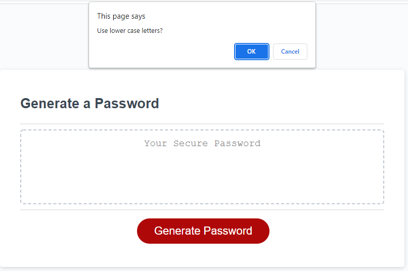
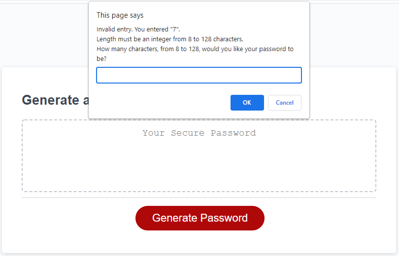
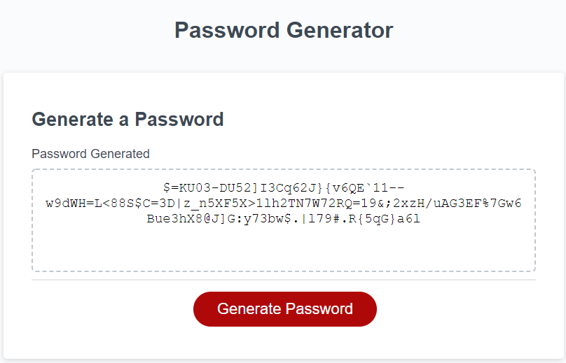

# User Story

```
AS AN employee with access to sensitive data
I WANT to randomly generate a password that meets certain criteria
SO THAT I can create a strong password that provides greater security
```

## Acceptance Criteria

```
GIVEN I need a new, secure password
WHEN I click the button to generate a password
THEN I am presented with a series of prompts for password criteria
WHEN prompted for password criteria
THEN I select which criteria to include in the password
WHEN prompted for the length of the password
THEN I choose a length of at least 8 characters and no more than 128 characters
WHEN asked for character types to include in the password
THEN I confirm whether or not to include lowercase, uppercase, numeric, and/or special characters
WHEN I answer each prompt
THEN my input should be validated and at least one character type should be selected
WHEN all prompts are answered
THEN a password is generated that matches the selected criteria
WHEN the password is generated
THEN the password is either displayed in an alert or written to the page
```
### To Use
```
You will see a page with a large red "Generate Password" button, clicking it will open some dialogs that dictate parameters of generating the password.
For the first four dialogs, simply clicking "OK or "Cancel" will give answers on whether or not to include those criteria.
At least one of the first four dialogs must be entered as "OK" or else it will correct you and repeat the dialogs.
```

```
The last dialog requires keyboard input. Valid input is an integer from 8 to 128.
If you enter invalid input, you will be presented with another prompt.
This additional prompt will tell you what you tried to input and allow you to input again.
Continuing to enter invalid input will cause the additional prompt to keep displaying until valid input is entered.
Clicking on "Cancel" on the prompt box will cancel out of the entire password generation process.
If you cancel the password generation process, you can begin again by clicking the red "Generate Password" button
```

```
After entering finishing with the dialog boxes, you should see a password matching the entered parameters generate in the box.
A "Password Generated" message will also appear on the page above the text box.
You can continue to use the button and generate additional passwords as long as you wish.
Generating additional passwords will not cause additional "Password Generated" messages to appear.
```

